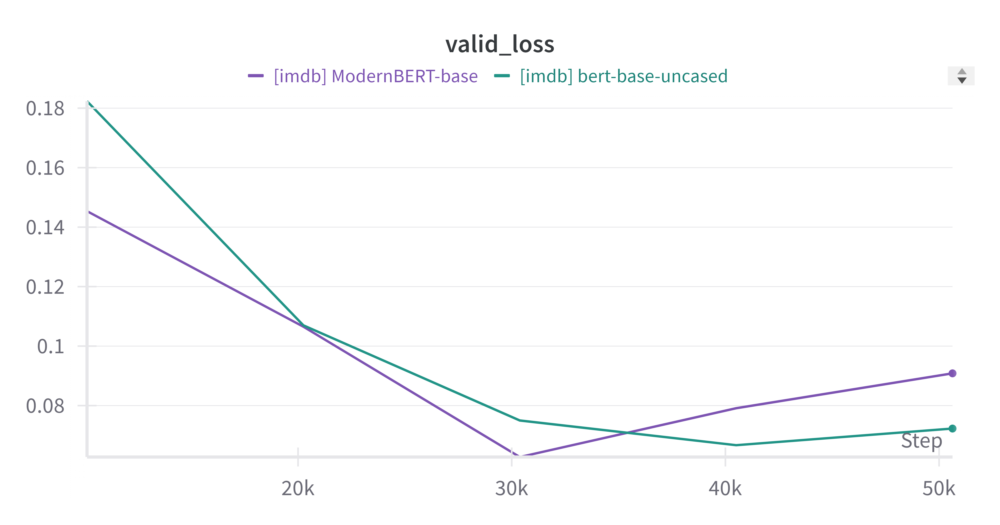
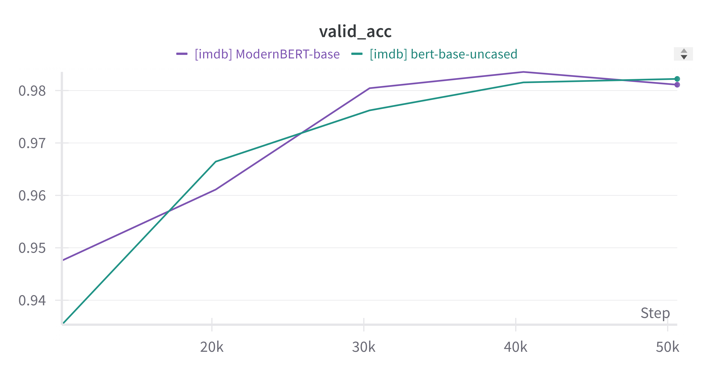
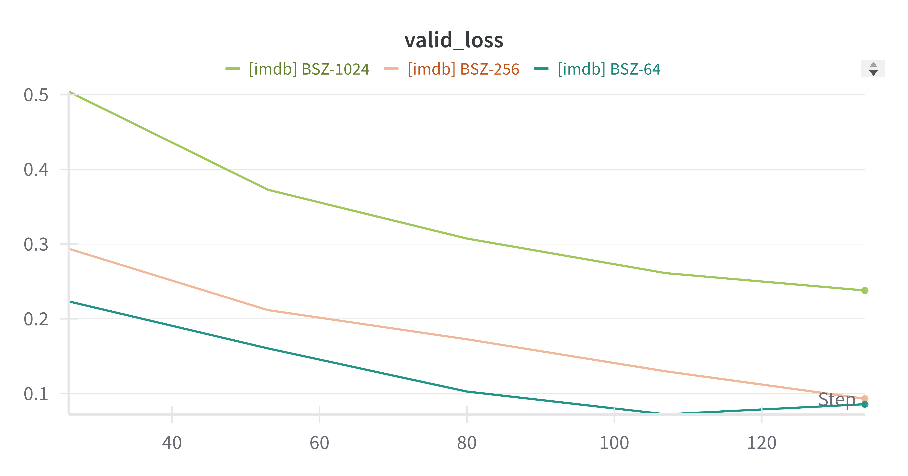
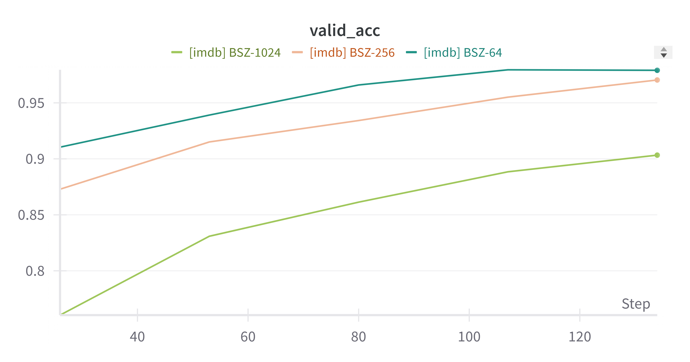

## Repository Overview
This repository contains NLP practice projects using PyTorch, focusing on sentiment analysis with the IMDB dataset.  

In `exp_1`, **two pre-trained models** from **HuggingFace** are used:
- **bert-base-uncased**
- **ModernBERT-base**

In `exp_2`, **gradient accumulation** was applied to the training of ModernBERT-base model from exp_1. Also, in main_accelerate, the same function of gradient accumulation was applied using **Accelerate** library from HuggingFace.

In `exp_2`, **gradient accumulation** was applied to the training of the ModernBERT-base model from `exp_1`. Additionally, in `main_accelerate.py`, the same gradient accumulation technique was implemented using the Accelerate library from HuggingFace.

# Exp1: NLP_practice - IMDB

## Configuration Files (`configs`)
Each `.yaml` file contains:
- The model name to load from Hugging Face.
- Experimental settings, such as:
  - Validation and test dataset size ratios
  - Batch size and number of epochs
  - Other training hyperparameters

## Code Structure
### `data.py`
- Loads the IMDB sentiment analysis dataset.
- Combines train and test sets, then splits into training, validation, and test sets (9:1:1).
- Token type IDs are included only when using **bert-base-uncased**, as **ModernBERT-base** does not require them.

### `model.py`
- Adds a classification head atop a pre-trained encoder for sentiment prediction.
- Outputs logits (0 or 1) using encoder representations.
- Uses **CrossEntropy** loss for optimization.

### `utils.py`
- Loads the selected model’s configuration file.

### `main.py`
Workflow summary:
1. **Set Device:** Use `'cuda'` if available.
2. **Load Data:** Invoke `get_dataloader()` from `data.py`.
3. **Set Optimizer:** Use the Adam optimizer.
4. **Initialize WandB:** Log into Weights and Biases (WandB) and set up the project directory.
5. **Train the Model:**
   - Train for 5 epochs.
   - Validate at each epoch.
   - Save checkpoints after each epoch.
6. **Test the Model:** Evaluate the best checkpoint on the test set.

## Results
Performance on **WandB**:
| **Model Name**        | **Test Loss** | **Test Accuracy** |
|-----------------------|--------------|-------------------|
| `bert-base-uncased`   | 0.0926       | 0.9778            |
| `ModernBERT-base`     | 0.0746       | 0.9832            |

**Validation loss curves**

**Validation accuracy curves**

## Discussion
As specified above, 'ModernBERT-base' outperformed 'bert-base-uncased'. Why so?
- Architectural Improvements: Disabled bias terms, RoPE, Pre-normalization, GeGLU activation.
- Training techniques: OLMo tokenizer, sequence packing, batch size scheduling, context length extension.

Conducting NLP experiments requires iterative testing with various configurations. Key best practices include:
- **Modularization:** Organize code into reusable components for flexible experimentation.
- **Documentation:** Maintain clear annotations for collaborative development.
- **Refactoring:** Keep code concise and maintainable.

This repository exemplifies best practices for model configuration, experiment tracking, and modular code design for NLP tasks.

# Exp2: Gradient Accumulation & Accelerator

In `main.py` and `main_accelerator.py` of the `exp_2` folder, the gradient accumulation was applied with and without Accelerator library, respectively.

## Results
| **Effective Batch Size** | **Test Loss** | **Test Accuracy** |
|--------------------------|---------------|-------------------|
| `64 (4 * 16)`            | 0.0787        | 0.988             |
| `256 (4 * 64)`           | 0.0746        | 0.9832            |
| `1024 (4 * 256)`         | 0.2408        | 0.899             |

**Validation loss curves**

**Validation accuracy curves**

## Discussion
From the results, an effective batch size of **64** appears to be the most suitable. While proper gradient accumulation settings improve training efficiency, excessively large batch sizes with a fixed number of epochs may lead to **undertraining**, as the model undergoes fewer updates. 

To counterbalance this, **increasing the number of epochs when using larger batch sizes** is a reasonable strategy to ensure sufficient training iterations and better convergence.

Indeed, when training the model with the effective batch size of 1024 over more epochs, the performance was improved a lot:
- **Test Loss**: 0.2408 -> 0.1216
- **Test Accuracy**: 0.899 -> 0.9604
